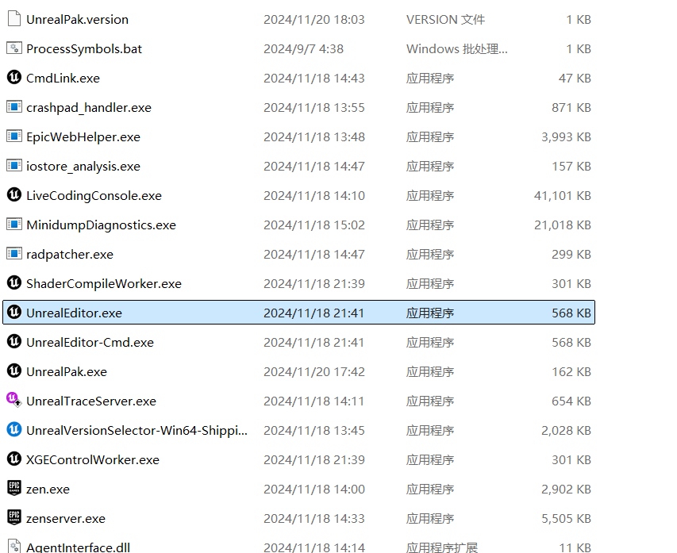

## 源码编译
参考：https://dev.epicgames.com/documentation/zh-cn/unreal-engine/downloading-unreal-engine-source-code#%E4%B8%8B%E8%BD%BD%E6%BA%90%E4%BB%A3%E7%A0%81  
注意要先将自己的github账号与epic关联
截图：
编译之后：

找到UnrealEngine-5.4\Engine\Binaries\Win64下的UnrealEditor.exe启动:

创建项目：
