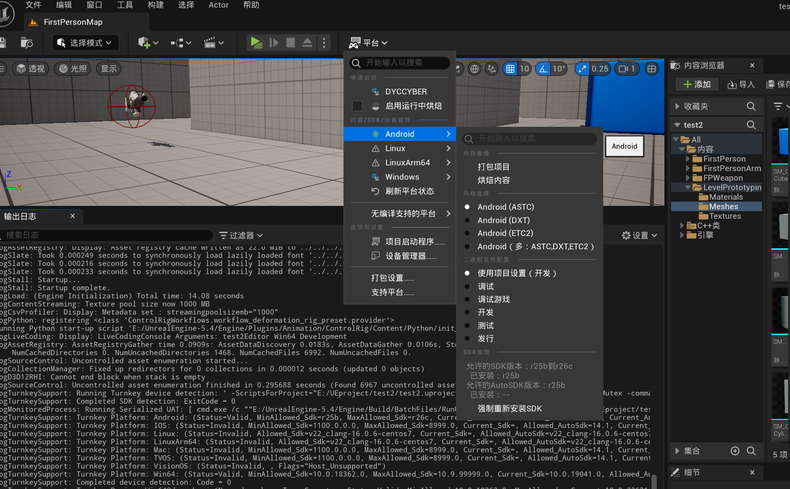
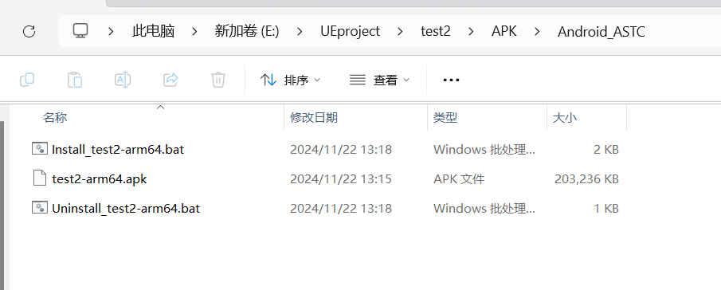

## 安卓打包
参考：https://blog.csdn.net/qq_35587645/article/details/139207695

使用turnkey设置安卓开发环境 这里我没有遇到问题

在打包时我遇到的一个问题是 gradle的问题 只需要在C盘用户目录下找到并删除相应gradle文件夹 之后重新打包即可（应该是网络问题

在下载apk文件到手机上遇到了permission required you must approve this premission in app settings: storage弹窗 而手机上又不能设置该权限

这里参考：https://www.cnblogs.com/XTG111/p/18550174 修改引擎源码一处地方 重新编译启动打包即可

**截图：**

